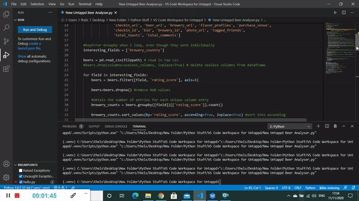

# Introduction

This project combines my love of craft beer with my love of programming! The current code produces a number of horizontal bar charts (see PNG images and PDF document in the "User Output Examples" directory). They provide statistics which are not available directly via the app (even if you pay the subscription) and would take a lot of time to obtain using a basic spreadsheet. I am focussing on statistics such as mean beer rating by beer style, country, brewery, and so on. My code only includes entries with the highest frequencies, to ensure that a beer with one high rating cannot elevate a brewery to the top of the graph, for example. 

Read more about Untappd here https://untappd.com/home

## To install using Windows:

1 - download this repo as a zip file and unzip it to your working directory.  
2 - install Python 3.9 to your working directory  
3 - open Windows command prompt for the steps below  
4 - if you would like to create a virtual environment at any stage, type ```py -m venv env```, where ```env``` is the name of your virtual environment. Activate the virtual environment by typing ```env\Scripts\activate.bat```.    
5 - install numpy by typing ```py -m pip install numpy==1.19.3``` into the cmd terminal. Version 1.19.4 produces a RunTime error in Windows at the time of writing (16/12/2020). 
6 - install pandas by typing ```py -m pip install pandas``` into the cmd terminal.  
7 - install matplotlib by typing ```py -m pip install matplotlib``` into the cmd terminal.  
8 - run by typing ```py -m Untappd_Beer_Analyser``` into the cmd terminal. Alternatively, type ```exec(open('Untappd_Beer_Analyser.py').read())``` into an interactive session.  

## To install using UNIX:  

1 - download this repo as a zip file and unzip it to your working directory.  
2 - install Python 3.9 to your working directory  
3 - go to the Terminal for the steps below  
4 - if you would like to create a virtual environment at any stage, type ```python venv env```, where ```env``` is the name of your virtual environment. Activate the virtual environment by typing ```source env/bin/activate```   
5 - If you’re on Linux and installed Python using your OS package manager, you may have to install pip separately for the steps below; see https://packaging.python.org/guides/installing-using-linux-tools/    
6 - Due to the way most Linux distributions are handling the Python 3 migration, Linux users using Python without creating a virtual environment first should replace the ```python``` commands below with ```python3``` and the ```pip``` commands below with ```pip3 --user```.    
7 - install numpy by typing ```pip install numpy``` into the UNIX terminal.  
8 - install pandas by typing ```pip install pandas``` into the UNIX terminal.  
9 - install matplotlib by typing ```pip install matplotlib``` into the UNIX terminal.  
10 - run by typing ```python Untappd_Beer_Analyser.py``` into the UNIX terminal.  

## To use:   
  
Click on open and select the file called "Untappd beers.csv". A pdf document of multiple bar charts will appear in the same directory as your csv file. If you are an Untappd user and have your own csv file from Untappd, use that to check out your own stats!

## Quick Demo (to be updated)



## Technologies

Python 3.9, NumPy 1.19.3, Pandas 1.1.3, Matplotlib 3.3.2

## Known Issues

There are some font and clipping issues with y-axis labels.

## Project Status

Still being developed. 
###### To do:
- fix known y-axis label issue
- rewrite in modules
- add other stats such as mean alcohol content, worst rated beers/breweries/cities..., correlations between alcohol content and rating, and so on
- deploy the project to the web


